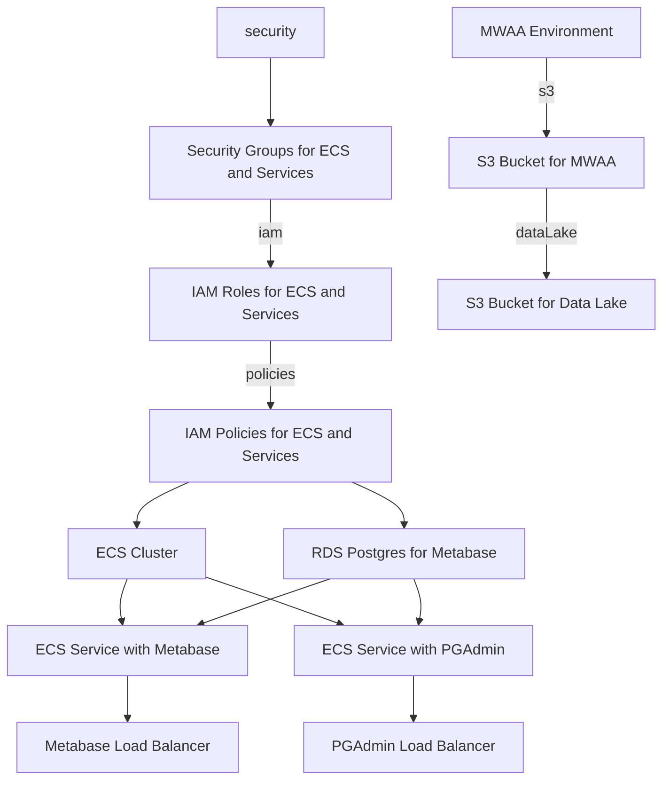

# Infrastructure as Code Repository

This repository contains Infrastructure as Code (IaC) to provision the following components on AWS:



> - Set up an ECS cluster for containerized apps.
> - Deploy Metabase and PGAdmin services on the ECS cluster.
> - Provision an RDS instance for Metabase.
> - Create ALBs for Metabase and PGAdmin.
> - Define security groups for both services.
> - Establish IAM roles and policies for Metabase and PGAdmin.
> - Provision an MWAA environment for workflow orchestration.
> - Create an S3 bucket for MWAA artifacts and logs.
> - Establish a centralized data lake using an S3 bucket.

## How to Use

Clone this repository to your local machine.

Customize the IaC templates in the /infra directory based on your specific requirements.

Run the IaC scripts using your preferred tool (e.g., AWS CloudFormation, Terraform) to deploy the infrastructure.

Feel free to reach out if you have any questions or encounter issues during the setup process. Happy deploying!

```bash
terraform -chdir=infrastructure/environments/production init
terraform apply -var="access_key=xxxxxx" -var="secret_key=yyyyyyy" -var="organization_name=coolorg" -var="domain=coolorg.cloud"  -var="environment=production"
```


## Architecture


## TODOS for terraforming mars AWS

[x] Clean up terraforming code (15. Dec. 2023)
[ ] Load balancer has to be a 1 to 1 relationship between a service and a load balancer. It distributes the load between the instances of the service. 
[ ] Code review terraform
[ ] Add a Staging env without super dense features
[ ] Add PG admin + Load balancer
[ ] Add a separate Database as a Warehouse - PostgreSQL 
[ ] S3 bucket for Pipelines and MWAA
[ ] Add MWAA apache airflow
