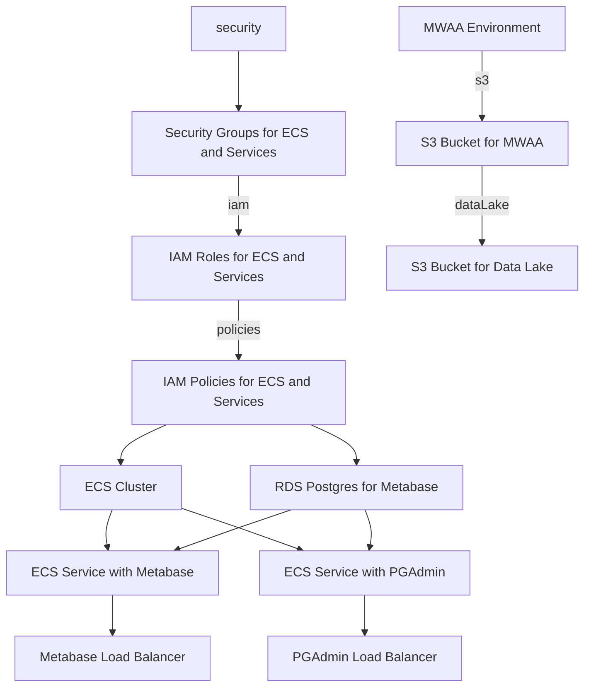

# Infrastructure as Code Repository

This repository contains Infrastructure as Code (IaC) to provision the following components on AWS:




> **1. ECS Cluster**
> Create an ECS cluster that will serve as the foundation for deploying containerized applications.

> **2. ECS Service with Metabase**
> Set up an ECS service running Metabase, a business intelligence and analytics tool, within the created cluster.

> **3. ECS Service with PGAdmin**
> Deploy an ECS service running PGAdmin, a web-based PostgreSQL administration tool, within the ECS cluster.

> **4. RDS Postgres for Metabase**
> Provision an RDS (Relational Database Service) instance running PostgreSQL, specifically configured to work seamlessly with the Metabase service.

> **5. ALB for Metabase**
> Create an Application Load Balancer (ALB) to distribute incoming traffic among multiple instances of the Metabase service, ensuring high availability and scalability.

> **6. ALB for PGAdmin**
> Set up a separate Application Load Balancer for PGAdmin to efficiently manage and distribute traffic to instances of the PGAdmin service.

> **7. Security Groups for Metabase and PGAdmin**
> Define AWS Security Groups to control inbound and outbound traffic for both the Metabase and PGAdmin services, enhancing network security.

> **8. IAM Roles for Metabase and PGAdmin**
> Establish AWS Identity and Access Management (IAM) roles for the Metabase and PGAdmin services, ensuring secure and fine-grained access to AWS resources.

> **9. IAM Policies for Metabase and PGAdmin**
> Define IAM policies to specify the permissions required by the Metabase and PGAdmin services, adhering to the principle of least privilege.

> **10. MWAA Environment**
> Provision an Amazon Managed Workflows for Apache Airflow (MWAA) environment, providing a scalable and serverless platform for orchestrating workflows.

> **11. S3 Bucket for MWAA**
> Create an S3 bucket to store artifacts, logs, and other data associated with the MWAA environment, facilitating seamless workflow execution.

> **12. S3 Bucket for Data Lake**
> Establish an S3 bucket to serve as a centralized data lake, allowing for secure storage and efficient management of diverse datasets.

## How to Use

Clone this repository to your local machine.

Customize the IaC templates in the /infra directory based on your specific requirements.

Run the IaC scripts using your preferred tool (e.g., AWS CloudFormation, Terraform) to deploy the infrastructure.

Feel free to reach out if you have any questions or encounter issues during the setup process. Happy deploying!

```bash
terraform -chdir=infrastructure/environments/production init
terraform apply -var="access_key=xxxxxx" -var="secret_key=yyyyyyy" -var="organization_name=coolorg" -var="domain=coolorg.cloud"  -var="environment=production"
```


## Architecture


## TODOS for terraforming mars AWS

[x] Clean up terraforming code (15. Dec. 2023)
[ ] Load balancer has to be a 1 to 1 relationship between a service and a load balancer. It distributes the load between the instances of the service. 
[ ] Code review terraform
[ ] Add a Staging env without super dense features
[ ] Add PG admin + Load balancer
[ ] Add a separate Database as a Warehouse - PostgreSQL 
[ ] S3 bucket for Pipelines and MWAA
[ ] Add MWAA apache airflow
